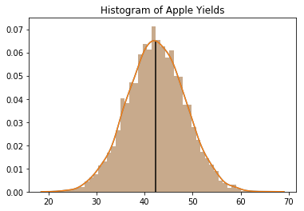
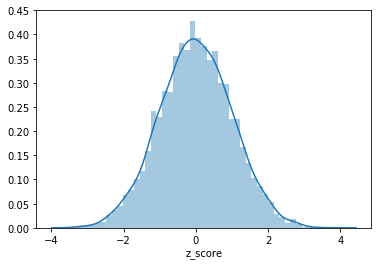

# The Standard Normal Distribution - Lab

## Introduction

In the previous lesson, you learned about the formula of the $z$-score, and looked at a few toy examples to explain an observation's standard score for normally distributed data. In this lab, you'll practice by standardizing and visualize some normal distributions.

## Objectives

You will be able to:

* Calculate and interpret the z-score (standard score) for an observation from normally distributed data
* Visualize data before and after standardization to visually inspect the results

## Let's get started

> A $z$-score can help identify how many standard deviations above or below the mean a certain observation is. Every time you obtain a $z$-score, use “above” or “below” in your phrasing.

The yields of apple trees in an orchard have been recorded in the file `yield.csv`. Each observation is recorded by weighing apples from trees (in pounds) and adding their weights. There are 5000 observations in total for this data. 

## Load, visualize and give general comments about the dataset

Use pandas for loading and inspecting the data.


```python

import pandas as pd
import numpy as np
import seaborn as sns
import warnings
import matplotlib.pyplot as plt
warnings.filterwarnings('ignore')


# Read the yield data as a dataframe
df = pd.read_csv('yield.csv')

df.head()
```


<div>
<style scoped>
    .dataframe tbody tr th:only-of-type {
        vertical-align: middle;
    }

    .dataframe tbody tr th {
        vertical-align: top;
    }

    .dataframe thead th {
        text-align: right;
    }
</style>
<table border="1" class="dataframe">
  <thead>
    <tr style="text-align: right;">
      <th></th>
      <th>0</th>
    </tr>
  </thead>
  <tbody>
    <tr>
      <th>0</th>
      <td>39.741234</td>
    </tr>
    <tr>
      <th>1</th>
      <td>39.872055</td>
    </tr>
    <tr>
      <th>2</th>
      <td>44.331164</td>
    </tr>
    <tr>
      <th>3</th>
      <td>46.600623</td>
    </tr>
    <tr>
      <th>4</th>
      <td>40.694984</td>
    </tr>
  </tbody>
</table>
</div>


```python
sns.distplot(df).set_title('Histogram of Apple Yields');
plt.vlines(df.median(), 0 , sns.distplot(df).get_lines()[0].get_data()[1].max());

```





```python
#The yields are normally distributed.

```

## Briefly explain what each value represents in this data set


```python
# Each value represents the yield from a single tree in terms of total weight of apples that were obtained from this tree

```

## Define the interval bounds which contain 99% of the observations   

> **Hint**: Recall the empirical rule related to $3\sigma$.


```python
# Perform any calculations necessary here
mean_ = df.mean().values
std_ = df.std().values
print(mean_- 3*std_)
print(mean_+ 3*std_)
```

    [24.39653434]
    [60.41871337]
    


```python
# 99% on the yeilds are going to occur between 24 lb and 61 lb.

```

## Compute and interpret the z-score for a tree yielding 35 pounds of apples


```python
# Calculate z
z = (35 - mean_)/std_
z
```


    array([-1.23384382])


```python
# This tree’s yield is 1.23 standard deviations below the mean yield.
```

## Suppose a tree has a z-score of 1.85. Interpret this z-score. What is the yield of this tree?


```python
# This tree’s yield is 1.85 standard deviations above the mean yield.
```


```python
# Calculate yield
1.85* std_+ mean_
```


    array([53.51446239])


```python
# What is the yield ?
# The yeild  is 53.5 lbs.
```

##  Convert each tree’s yield to a z-score so the new variable is the “z-score for weight”

The units are still the apple trees. For the data set of all z-scores:

* What is the shape? 
* The mean? 
* The standard deviation?


```python
# Give your solution here 
df['z_score'] = (df['0']-mean_)/std_
sns.distplot(df['z_score'])
print('Mean:', round(df['z_score'].mean()))
print('Standard Deviation:', df['z_score'].std())
```

    Mean: 0.0
    Standard Deviation: 1.0
    





## Summary

In this lab, you practiced your knowledge of the standard normal distribution!
